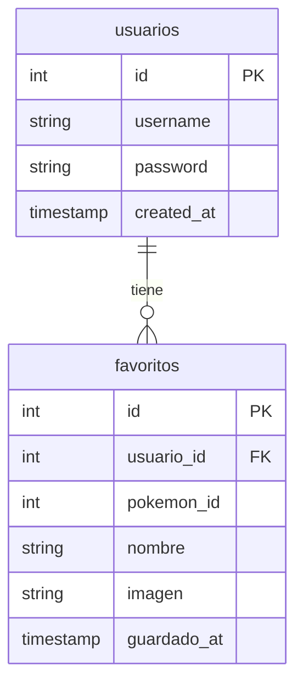

# Pokédex Web Project

¡Bienvenido a la documentación de la Pokédex! Este proyecto es una aplicación web interactiva que permite explorar el mundo Pokémon utilizando la **PokéAPI**, con un sistema completo de usuarios y favoritos.

---

## Tecnologías Utilizadas

El proyecto está construido combinando tecnologías modernas de frontend y un backend sólido:

### **Frontend**
*   **HTML5**: Estructura semántica de la aplicación.
*   **CSS3**: Diseño personalizado con una estética moderna, uso de Flexbox, Grid y efectos visuales (glassmorphism).
*   **JavaScript (Vanilla ES6+)**: Lógica del cliente, peticiones asíncronas con `fetch`, manipulación del DOM y gestión de eventos.

### **Backend**
*   **PHP**: Gestión de la lógica del servidor, manejo de sesiones de usuario y endpoints de API interna.
*   **MySQL**: Base de datos relacional para almacenar usuarios y sus Pokémon favoritos.

### **Integraciones**
*   **PokéAPI**: Fuente externa de datos para obtener información detallada de los Pokémon (tipos, estadísticas, imágenes, etc.).

---

## Estructura de Archivos

Para facilitar el mantenimiento, el código está organizado de la siguiente manera:

### Directorio Raíz
*   `index.php`: El punto de acceso principal que gestiona la redirección y la vista inicial de la Pokédex.

### Carpeta `paginas/`
Contiene las interfaces de usuario secundarias:
*   `login.php` / `registro.php`: Gestión de acceso y creación de cuentas.
*   `logout.php`: Finalización de sesión.
*   `favoritosh.php`: Vista de la colección personal de Pokémon favoritos.

### Carpeta `css/`
*   `styles.css`: El corazón visual del proyecto, contiene todos los estilos y animaciones.

### Carpeta `sql/`
*   `update_db.sql`: Script SQL para crear la base de datos y las tablas necesarias.

### Carpeta `includes/`
Contiene la lógica compartida y configuraciones de bajo nivel:
*   `conexion.php`: Establece el enlace con la base de datos MySQL y gestiona el inicio de sesión global.
*   `Logger.php`: Un sistema de registro (logs) para monitorear errores y eventos importantes del sistema.

### Carpeta `api/`
Endpoints que responden a peticiones AJAX desde el frontend:
*   `favoritos.php`: Maneja el guardado y eliminación de favoritos.
*   `listar_favoritos.php`: Devuelve la lista de favoritos del usuario en formato JSON.
*   `verificar_favorito.php`: Comprueba si un Pokémon específico ya es favorito del usuario actual.

### Carpeta `js/`
Lógica interactiva del lado del cliente:
*   `script.js`: El motor principal. Gestiona las llamadas a la PokéAPI, el filtrado por generaciones y la actualización dinámica de la interfaz.
*   `favoritos.js`: Lógica específica para la página de favoritos (eliminar, mostrar detalles).

## Base de Datos (Modelo ER)

El sistema utiliza una base de datos relacional para gestionar la persistencia. A continuación se muestra la estructura y relación entre las tablas:

---

## Diseño y Paleta de Colores

Para mantener una estética coherente con la temática Pokémon y ofrecer una experiencia de usuario premium, se utiliza la siguiente paleta:

| Muestra | Color | Hexadecimal | Uso en la Interfaz |
| :---: | :--- | :--- | :--- |
|  | **Rojo Pokédex** | `#c0392b` | Color de marca, botones y bordes superiores. |
|  | **Rojo Oscuro** | `#a93226` | Estados hover en botones. |
|  | **Rojo Acento** | `#e74c3c` | Iconos de favoritos (corazón) y errores. |
|  | **Verde Éxito** | `#27ae60` | Mensajes de confirmación y registro. |
|  | **Fondo General** | `#f5f5f5` | Fondo de la aplicación. |
|  | **Blanco Nieve** | `#ffffff` | Fondo de tarjetas y formularios. |
|  | **Gris Suave** | `#dddddd` | Bordes y líneas divisorias. |
|  | **Gris Texto** | `#333333` | Color base para textos principales. |
|  | **Gris Secundario**| `#888888` | Números de Pokémon y leyendas. |

---

## Funcionamiento

1.  **Autenticación**: El usuario debe registrarse e iniciar sesión (gestionado por PHP Sessions).
2.  **Exploración**:
    *   Puedes buscar un Pokémon por **nombre o número**.
    *   Puedes filtrar por **tipos** (Fuego, Agua, etc.), lo cual agrupa automáticamente a los Pokémon por su generación original.
3.  **Favoritos**: Al ver un Pokémon, puedes pulsar el corazón (♥). Esto envía una petición a la carpeta `api/`, que guarda la información en la base de datos.
4.  **Persistencia**: Tus favoritos se mantienen guardados y asociados a tu cuenta, listos para ser vistos en la sección "Mis Favoritos".

---

## Notas de Instalación
1.  Importa el archivo contenido en `sql/update_db.sql` en tu gestor de base de datos.
2.  Configura las credenciales de acceso en `includes/conexion.php`.
3.  Sirve el proyecto usando un servidor local como **XAMPP**, **WAMP** o **Laragon**.
